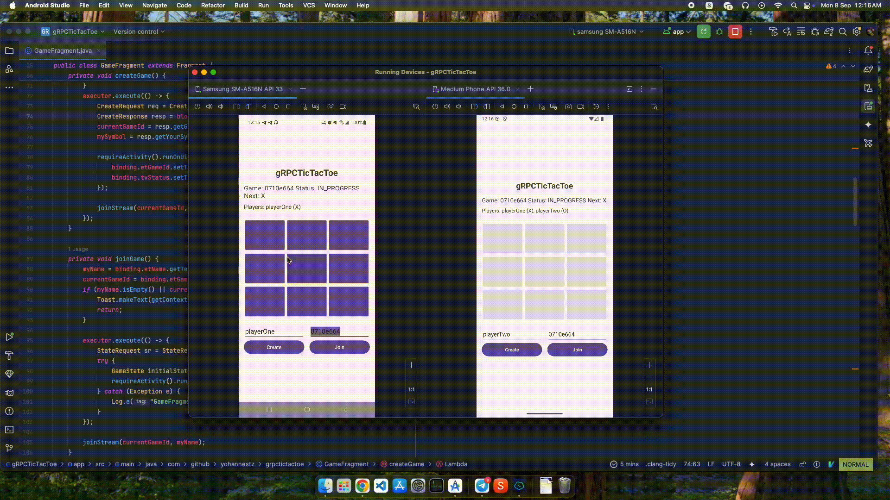

# gRPC Tic-Tac-Toe

A real-time, multi-player Tic-Tac-Toe game demonstrating the power of gRPC for building efficient and type-safe communication between an Android client and a Node.js server. This project was born from the frustration of API mismatches and serves as a practical example of how gRPC can create a robust contract between frontend and backend.

  

